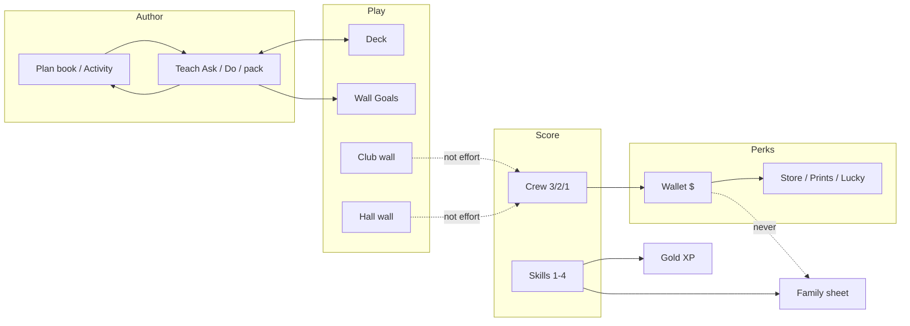

# TechWorks architecture · v1.92.46

© 2026 Richard Kulibert. TECHWORKS™ v1.92.46.
TECHWORKS™ is a trademark of Richard Kulibert.
Classroom salary, skills, and workshop desk. Aliases only on public surfaces. Google Sheets remains the archive. Not licensed for redistribution without permission.

How the shop is wired. In-app: **Admin → Docs**. Help **?** is the role book.



## One desk, four jobs

TechWorks is one shop PC gradebook with four kinds of number. They never average into each other. The wall is a projector of aliases. Admin is the writer.

**Lanes**

- **Author:** Plan book · Teach · Projects / Activity
- **Play:** Deck · Wall · Club wall · Hall wall
- **Score:** Crew pad 3/2/1 · Teacher Score · Skills 1–4
- **Perk / after:** Wallet $ · Store · Prints · Lucky · Club IN · Hall HERE

- Cog = Settings (Admin). Arrange wall / Arrange plates live on those pages.
- Shop PC writes. Cloud is a locked copy. Drive is a download, not a live sync.

## Plan book → Teach → Deck → Wall

One write. You type the hour once. Every play surface reads that hour. Deck is not a second copy.

### How a class hour is born

```
New Activity / Plan book  —dates + grade + belong→  Parked unit on that period
Teach Ask / Do / Objective  —leave field or change P→  teachDays + the same unit
Teach hour pack  —Workshop / Demo / …→  Enter · Listen · Work · Cleanup beats
Deck Present  —reads teachJob→  Slides for this P + date
Deck Edit slides  —same saveTeach* writes→  Teach + Plan book
Wall Goals plate  —jobCardOf + teach override→  Question, rules, today, done, look-for
```

### Lesson fields — who shows them

| Field | Written on | Teach | Deck | Wall | Plan book | Family |
| --- | --- | --- | --- | --- | --- | --- |
| Ask / driving question | Teach or Activity | Yes | Title slide | Goals plate | Unit prompt | No |
| Do this now | Teach or Activity.today | Yes | Prove / beats | Today line | Activity | No |
| Objective / done | Teach or Activity.done | Yes | Prove | Done line | Activity | No |
| Look-for a 3 | Activity.lookFor | Hour line | Prove | Look-for | Activity | No |
| Rules / goggles | Project constraints | Listen beat | Rules slide | Rules | Write the job | No |
| Hour pack (Workshop…) | Teach only | Chips | Beat kicker | No | No | No |
| STEM sentence | Project stemLine | Objective fallback | Title line | Under question | Unit | No |
| Skill 1–4 expected | Activity.expect | No | No | Look-for n = | Activity | Words after you score |

**Do not**

- Deck does not keep its own lesson file anymore. Old techworks-deck-v1 is leftover chrome, not the hour.
- Wall does not show legal names, IEP, wallet, Lucky, or SCOREPIXEL / grading debt.

## Four number systems (do not mix)

A 3 on the crew pad is not a 3 on a skill. Gold XP is not class cash. Family report is the project mark in words.

### What each number is

| System | Scale | Who taps | Pays / feeds | On the wall | On Family |
| --- | --- | --- | --- | --- | --- |
| Crew effort | 3 / 2 / 1 + A E P | Crew lead or teacher Score | Wallet $ that day; Week race | Top XP uses skills, not this. Week race uses 3 as full share | Time in class listed, not averaged |
| Skill | 1 Beginning … 4 Distinguished | Teacher Watch / Sit-down | Gold XP (that many points) | Skills board / gold numbers | Skills in plain words |
| Perks $ | Wallet | Auto from 3/2/1; Store / Lucky / Prints spend | Store, Lucky, Prints, cleanup miss −$10 | Perks board if you flip it | Never |
| Project grade | 100 / 85 / 70 / blank | Teacher Grades (from 3/2/1 + skills) | Classroom CSV | Never | The one mark |

**Do not**

- Wallet, stock, Lucky Bench, and personal-day docks never enter the family mark.
- A crew-lead 3 is not Distinguished. Distinguished is a teacher 4.
- Club IN ($10 + 2 XP) is not class effort.
- Hall HERE / NURSE is not Tech effort.

## People and crews

A worker is a locked id. The wall shows an alias minted from that id, never from the legal name.

### Identity

| Bit | Where it lives | Wall | Profile (locked) | Family | Export |
| --- | --- | --- | --- | --- | --- |
| Locked id | students[].id | Hidden | Hidden | Hidden | Encoded live export |
| Alias (first) | students[].first | Yes | Yes | Yes | Yes |
| Legal name | vault legalFirst/Last | Never | Show full info | After PIN | VAULT tab only |
| IEP / 504 | flags | Never (deco dots inside Show full) | Show full info | No | VAULT |
| Crew key | crewKey + crewDays | Crew plates | Yes | No | Class tabs |
| Period / grade | period, grade | P chips | Yes | Yes | Yes |

- Admin → Crews: size, deal, look, crown. Separate rules live on Roster.
- Rosters page is the yearbook of aliases. Legal names stay in Admin → Records.

## Score, Week, Year, Data

Teacher Score is name + 3/2/1 on one row. Crew pad is the teal kiosk. Week race is yesterday so today can still be scored.

### Scoring surfaces

| Surface | Who | Writes | Shows |
| --- | --- | --- | --- |
| Crew pad | Lead, PIN 2222 for other P | 3/2/1, A/E/P, INVEST? | This period’s crew only |
| Teacher Score | PIN | Same codes + Assist / Clean / cash | All crews, period chips |
| Week | Anyone | Nothing | Classes & crews earned vs possible as of yesterday. Gold #1 class and #1 crew |
| Year | Teacher | End session archive | Cohort XP / $ vs cohort |
| Data | PIN | Nothing (graphs) | Look-back. Mix-in hall is opt-in |

## Learn: Book, Projects, Skills, Words, Grades

Learn is the filing cabinet. Teach is still the author of today.

### Learn → rest of the shop

| Learn tool | Writes | Feeds |
| --- | --- | --- |
| Projects / Plan book | Unit, activities, dates, belong, skill, prove | Teach job, Wall Goals, Deck, lesson PDF |
| Watch one skill | skillLog 1–4 + stem | Gold XP, Family words, Grades Skill column |
| Standard 5 / NY Tech | Same 1–4 on S1–S7 | XP, CSV |
| Word Heat | Streak this heat only | Nothing else (not wallet, not grade) |
| Grades | Optional override; else calculated | Classroom CSV, Family mark |
| Book | Reference | Stems / why a 3 |

## Tech Club and Study Hall

After-school modules. They have a desk (author) and a wall (play). They do not mix into Tech 3/2/1.

### Club

| Bit | Written on | Club wall | Class wall | Wallet / XP | Effort grade |
| --- | --- | --- | --- | --- | --- |
| SET date + pack (Talk/Stations/…) | Admin Club desk | Agenda until Work | No | No | No |
| Agenda / brief | Club desk, one directive | Yes until Release | No | No | No |
| Stations / contest / timer | After Work | Yes | No | No | No |
| Sign in (alias match) | Club IN | Badge | No | +$10 + 2 XP once that day | No |
| Late bus / pickup | Member dismiss | Cleanup 3:00–3:05 | No | No | No |

### Study Hall (P6)

| Bit | Written on | Hall wall | Class wall | Tech effort |
| --- | --- | --- | --- | --- |
| HERE / NURSE / LIBRARY / TEACHER | Hall pad (PIN) | Counts, not names of who is out on projector | No | No |
| Line leader | Weekly | Yes | No | No |
| Hall store | Separate catalog | No | No | No |
| P6 on class wall | Bell strip | Time only | Time only | No |

## Wallet, Store, Prints, Lucky, Stocks, Reward

Class cash is a perk game for showing up. It is not the grade. Modules can hide the tabs; the wallet can still exist.

### Money flows

| Event | Wallet | XP | Wall | Family |
| --- | --- | --- | --- | --- |
| 3 / 2 / 1 pay | +$25 / $20 / $15 | No | Perks board only | No |
| A / E | $0 | No | No | Time listed |
| P personal | −$25 | No | No | No |
| Cleanup miss | −$10 | No | No | No |
| Cleanup catch (teacher) | +$5, max 2/day | No | No | No |
| Store buy (PIN) | −price | No | No | No |
| Prints buy / trade | Wallet or trade | No | Gallery once released | No |
| Lucky Bench | Stake / payout | No | No | No |
| Invest / Stocks | Pay leaves wallet → principal | No | Not on rank | No |
| Club IN | +$10 | +2 XP | No | No |
| Class reward bar | Module | Optional XP target | RewardBar if on | Optional grade target |

## Screens and who may open them

Locked chrome is the projector. PIN opens the writer. Crew 2222 is the kiosk, not Admin.

### Chrome map

| Screen | Lock | Kids see | Teacher writes |
| --- | --- | --- | --- |
| Wall | Open | Aliases, XP, $, job, clock, cleanup | Arrange wall (PIN) |
| Teach | Open to read | Ask / beats, no names | Ask, Do, pack, plates |
| Deck | Open to Present | Slides | Edit slides → Teach |
| Week / Year | Open | Race, rings | Archive on Year |
| Club wall / Hall wall | Open | Agenda / HERE counts | On the desk |
| Learn Words | Open | Shop vocab | Bank |
| Crew pad | 2222 / live P | Teal 3/2/1 | — |
| Score / Rosters / Admin / Store / Grades | Teacher PIN | Never | Yes |
| Family sheet | Tap alias; legal after PIN | Project mark, skill words | — |
| Embed ?embed=1 | Wall only | Same as Wall | No dock |

## Where the bits live

Three copies. None of them is live Google Drive sync.

### Copies

| Copy | Holds | Does not hold |
| --- | --- | --- |
| This PC (gradebook) | Roster, marks, skills, projects, teachDays, club, prints, vault names | Theme, layout, PIN, Fake data toggle (browser only) |
| Cloud (desk key) | Same vault, encrypted | Theme / PIN / Fake data. Empty PC will not overwrite names |
| Drive folder | JSON + Google book you download | Live watch. VAULT tab = legal names — do not share |

- Teacher PIN = Set teacher PIN. 1111 is rejected. Never print it.
- Crew 2222 stays off the student About card.
- Live URL tw.kulibert.net ← Cloudflare Pages kulibert-desk ← github.com/trebiluk/TechWorks main. Public repo ships students: [].

## Forward compatibility (this app will keep changing)

New fields are additive. An older build must still open a newer desk without wiping what it does not understand. Schema never goes backwards.

### Rules

| Move | What happens |
| --- | --- |
| Add a student or config field | migrate, compact, pack, unpack, and cloud keep it |
| Bump app version | chip + changelog. Desk schema 12 stays until the pack shape changes |
| Newer schema on this PC | open it, keep the higher schema stamp, keep extra keys |
| Older localStorage key | still read techworks-desk-v11 … v12 |
| Cloud pack v2+ | open if kind is techworks-cloud and vault is present |
| New module | add to FEATURES; default off if it is a game. JSON modules map is a bag |
| Rename or delete a field | needs a real migrate step — never silent drop |

**Do not**

- Do not whitelist-copy students in compact. Unknown keys ride.
- Do not stamp schema 12 over a 13 pack.
- Do not auto-push an empty PC over a named cloud roster.
